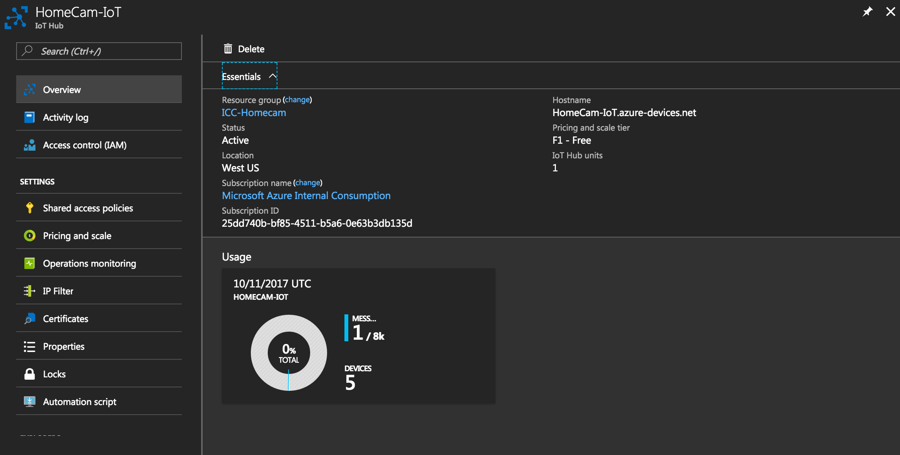
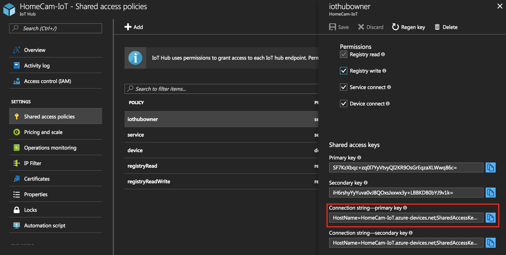
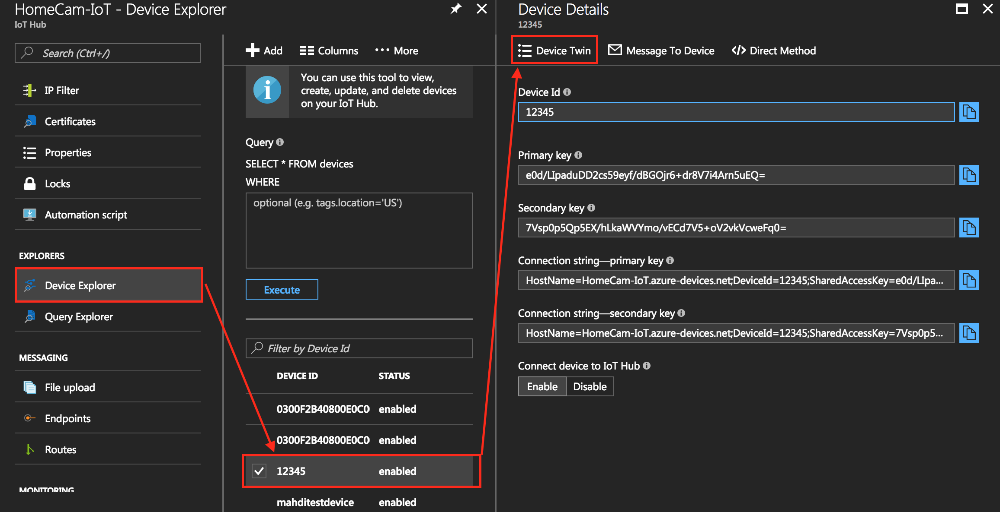
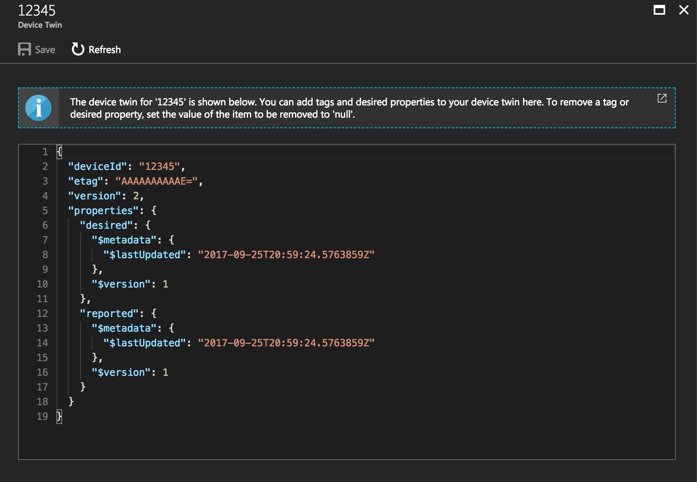

# XamCam IoT Functions Readme

The Following will show you how to create an IoT Hub in Azure and create Azure functions to create/register/delete iot devices registrations from your Hub. 

The IOTManager project contains a DeviceManager class which communicates with our Azure IoT Hub. Through this class we can provision new IOT Devices and get their connectionstrings, which we then use (from the client side, or the IoT device) to interact with the "Device Twin" - a digital representation of the various states of the IoT Device. 

## Setup

### Creating the IoT Hub in Azure
1. In the azure portal, navigate to New. Search for IoT Hub and click Create
2. Name your IoT Hub, fill out the resource group (either new or existing).
Leave all other fields untouched
3. Click Create

### Getting the HostName and ConnectionString for the IOTManager
The file Constants.cs in the IOTManager project contains a few properties that we need to get from our newly created IotHub.

1. Navigate to your ResourceGroup that contains the newly created IoT Hub, and click on the IoT Hub
2. Under "Overview" - copy and paste the value for "HostName" to the <HostName> property in Constants.cs

3. Under "Shared access policies" - click on "iothubowner" and copy the value of "Connection string—primary key" into the <ConnectionString> property in Constants.cs

### The Device Twin

***What is the device twin?***

Device twins are JSON documents that store device state information (metadata,configurations, and conditions). IoT Hub persists a device twin for each device that you connect to IoT Hub. 

For more information on device twins, visit this article on [understanding device twins.](https://docs.microsoft.com/en-us/azure/iot-hub/iot-hub-devguide-device-twins)

#### In the device explorer panel, add a device (provide a unique ID) and view it's twin:

### Azure Functions API Reference
There are 3 api endpoints defined within the functions project: 

**GET or POST: /api/AddDevice/id/{uniqueDeviceIdAsString}**

- Takes in a string parameter for the ID of the IoT device. This string has to be unique.

- If device doesn't exist it creates a new one, and returns the connection string to IoTHub. If it does exist it simply returns the connection string

**PUT or DELETE: /api/DeleteDevice/id/{DeviceId}**
 - This endpoint deletes the device specified by the id if it exists

**GET: /api/GetDevices/{Optional ID parameter}**

 - Returns a List of devices. 
 - If the deviceID parameter supplied - it returns that device
- If no parameter supplied - it returns ALL devices

